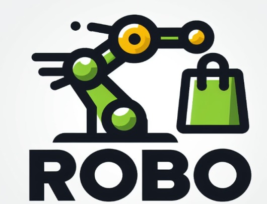
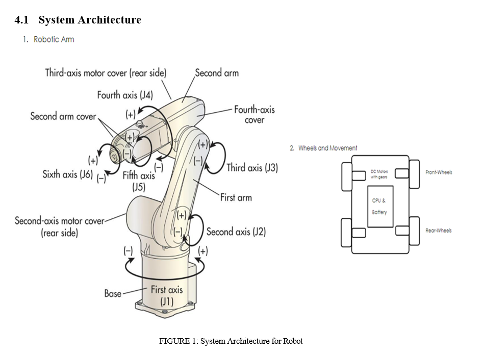
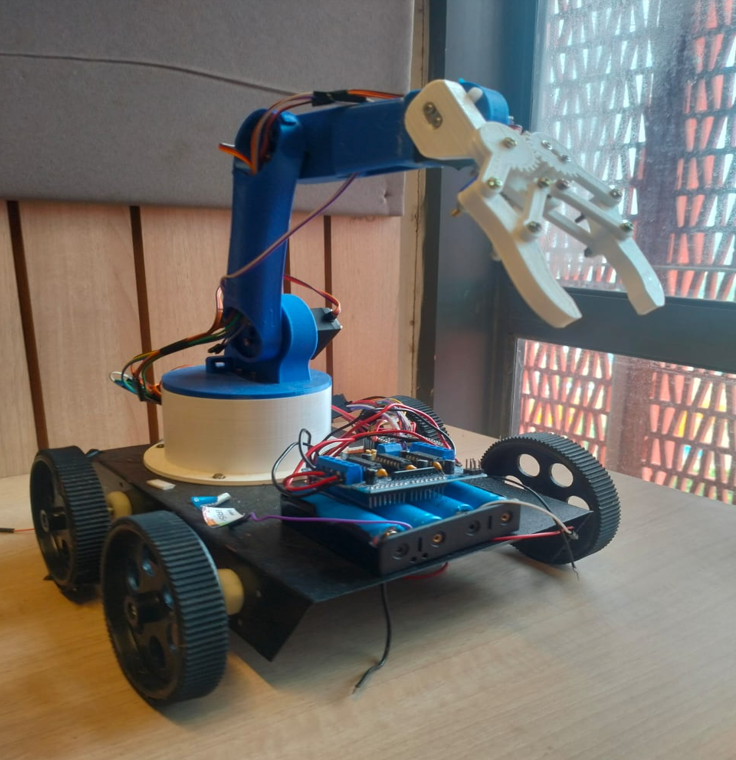
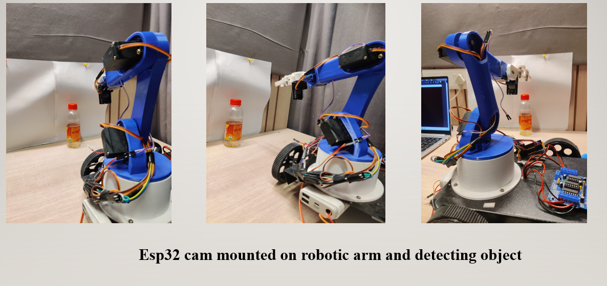
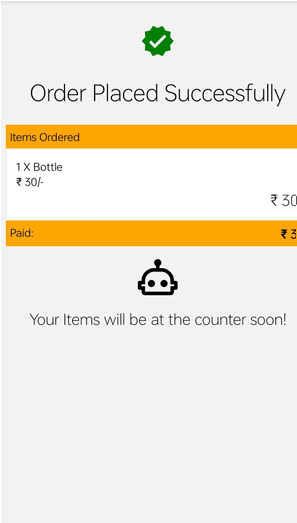

# 🤖 IntelliShop 🛒

A smart retail experience powered by AI and robotics.

<div align="center">
  
</div>

## 📋 Project Overview

<div align="center">
  <a href="./assets/Ai%20%26%20Robotics%20based%20IntelliShop.pdf">
    
    <p><em>Project Overview - Click for detailed presentation</em></p>
  </a>
</div>

## 📱 About

IntelliShop is a revolutionary retail application that integrates AI and robotics to enhance the shopping experience. The application allows users to place orders, track deliveries, and interact with robotic assistants in store.

<div align="center">
  
  <p><em>Prototype Design</em></p>
</div>

<div align="center">
  
  <p><em>Robot Implementation</em></p>
</div>

### 🎥 Working Robot Demo

Watch our robot in action as it detects desired objects, picks them up, and navigates to target locations:

<div align="center">
  <a href="https://drive.google.com/file/d/1CxIL6LfEUVjQOvAsG3xFWevNpdCRH7L0/view?usp=sharing" target="_blank">
    
    <p>Click to watch the robot demonstration</p>
  </a>
</div>

## 🔄 System Architecture

The IntelliShop system combines mobile technology, AI algorithms, and robotic systems for a seamless shopping experience.

<div align="center">
  
</div>

## 🤖 Object Detection AI Model

Our custom trained object detection model identifies products in real-time, enabling automated inventory management and smart shopping assistance.

### 📹 Training Video

Check out our AI model training process:

<div align="center">
  <a href="https://drive.google.com/file/d/1pU5b5qcOeHuBs1Cc5vh-aFY1xKcisNlR/view?usp=sharing" target="_blank">
    
    <p>Click to watch the training video</p>
  </a>
</div>

## ✨ Features

- 🔐 User authentication and profile management
- 🔍 Product browsing and search functionality
- 🛒 Shopping cart and checkout process
- 📦 Order tracking and history
- 🤖 Robotic assistant integration
- 💡 AI-powered product recommendations

## 📸 Screenshots

<div align="center">
  
</div>

## 📚 Documentation

For full documentation about the project, check out our:

- 📑 [AI & Robotics based IntelliShop Presentation](./assets/Ai%20%26%20Robotics%20based%20IntelliShop.pdf)
- 📝 [Complete Project Report](./assets/Project%20Report.docx)

## 🚀 Getting Started

### Prerequisites

- ⚙️ Node.js (>= 14.0.0)
- 📦 npm or yarn
- 📱 Expo CLI

### Installation

1. Clone the repository
   ```
   git clone https://github.com/naman-bhayana/intellishop.git
   cd intellishop
   ```

2. Install dependencies
   ```
   npm install
   ```
   or
   ```
   yarn install
   ```

3. Start the development server
   ```
   npm start
   ```
   or
   ```
   yarn start
   ```

## 💻 Technologies Used

- ⚛️ React Native
- 📱 Expo
- 🔥 Firebase (Authentication, Firestore, Storage)
- 🧭 React Navigation
- 🧠 TensorFlow (Object Detection)
- 🤖 ROS (Robot Operating System)

## 👥 Author

- **Naman Bhayana**  
  [GitHub](https://github.com/naman-bhayana) | [LinkedIn](https://www.linkedin.com/in/namanbhayana007)

## 📄 License

This project is licensed under the MIT License - see the LICENSE file for details.

